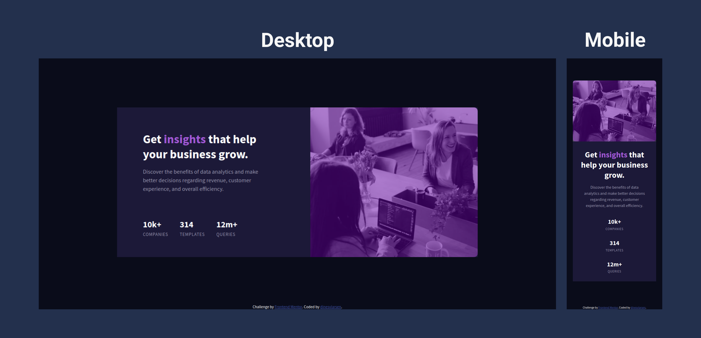
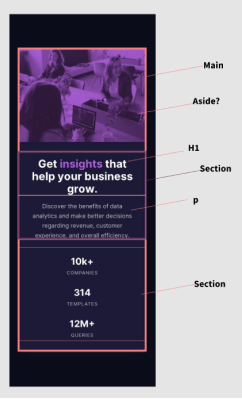
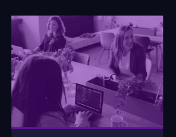

# Frontend Mentor - Stats preview card component solution

This is a solution to the [Stats preview card component challenge on Frontend Mentor](https://www.frontendmentor.io/challenges/stats-preview-card-component-8JqbgoU62). Frontend Mentor challenges help you improve your coding skills by building realistic projects.

## Table of contents

- [Overview](#overview)
  - [The challenge](#the-challenge)
  - [Screenshot](#screenshot)
  - [Links](#links)
- [My process](#my-process)
  - [Built with](#built-with)
  - [What I learned](#what-i-learned)
  - [Continued development](#continued-development)
  - [Useful resources](#useful-resources)
- [Author](#author)

**Note: Delete this note and update the table of contents based on what sections you keep.**

## Overview

### The challenge

Users should be able to:

- View the optimal layout depending on their device's screen size

### Screenshot



### Links

- Solution URL: [Add solution URL here](https://your-solution-url.com)
- Live Site URL: [Add live site URL here](https://your-live-site-url.com)

## My process

I started with imagining how I should construct the html semantics (since this is something I'm interested in, tried to ask around what people thought of my screen shot). Sadly I didn't get any guidance, but just sketching the semantics up kind of helped me visualize a bit how the content should be organized. (I didn't follow this completely, but I did just more semantic tags than I've usually done.)

This time I took a mobile first approach, so I made the webpage 375 wide in the dev tools, and started laying out the content. When the mobile view was done I started sizing the dev tools a bit up until I saw that things were breaking, and adjusted accordingly.

The thing I really like about doing a mobile first approach is that content looks really good with it's basic responsiveness until a very high resolution, so you don't need as many media queries.

I added media queries only when I had to change the structure of the layout, which I did where I saw fit (one was mostly for the tablet view, so I could gather the detail section into one horizontal line instead of having them as a vertical one, since that made the component look really long).



### Built with

- Semantic HTML5 markup
- Vanilla CSS
- Flex-box
- Mobile-first workflow

### What I learned

So the number 1 thing I was struggling a lot with was the way the image I was going to use was provided in B/W, so I had to make it purple by applying css.

I have never done this before so there was a lot of trial and error to finding out how to get the correct color. I ended up making an image container, which I gave a purple background, and then lowered the opacity on the image itself. But for some reason the container was a bit bigger than the image, so there was a small purple line appearing under the image:



I managed to fix this after a lot of googling and trial and error, but eventually learnt about this CSS property

```css
img {
  vertical-align: top;
}
```

which basically just aligned it to the top of the tallest element (which I guess is the container in this setting.)

Apart from that major hiccup most things went pretty smoothly, I really felt how much easier it was to make things responsive with the mobile-first workflow, now I just have to keep that in mind for future projects.

Also felt like I got more comfortable with flex-box, had to use the property: order; to change up the layout on bigger views, because the image I had first in the mobile view, but on the desktop-view it is on the right.

I also used the universal CSS selector (\*), to reset the paddings, margins, borders, and outlines since I heard in a video that this is a very common practice, and really helps with spacing out the contents. Which I definitely felt, a lot easier to play around with margins and paddings when you don't have to worry about any default values.

I was also told that on bigger projects you should stay away from the universal selector, because it apparently affects all elements, even if they don't have default values, which can add to webpage load times. So that is definitely something I'll keep in mind.

### Continued development

I still want to get comfortable with the fundamentals of rems/ems, flex-box, and figuring out layout issues and spacing etc.
I'm still very interested in learning CSS-grid, and I'm following a course where I am closing inn on that section, so really excited for that, and in future project you might see that used a bit more.

Still don't feel completely comfortable with the semantics, but I feel like that'll come as I continued to google them when applying them around, maybe I'll look for an article on it at some point?

### Useful resources

- [css-tricks a guide to flexbox](https://css-tricks.com/snippets/css/a-guide-to-flexbox/) - I've been using this site to reference a lot of the flex-box properties, so it is definitely a savior.
- [Google](https://www.google.com) - This is probably no surprise for people, but I use this like A LOT.
- [Discord](https://www.discord.come) - I'm part of a couple of web-dev discords, where I can bounce questions and ideas off, which is definitely a huge help at times.

## Author

- Frontend Mentor - [@dinesvlarsen](https://www.frontendmentor.io/profile/dinesvlarsen)
- Twitter - [@dinesvlarsen](https://www.twitter.com/dinesvlarsen)
